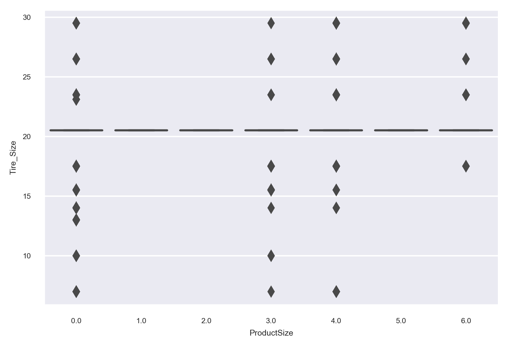
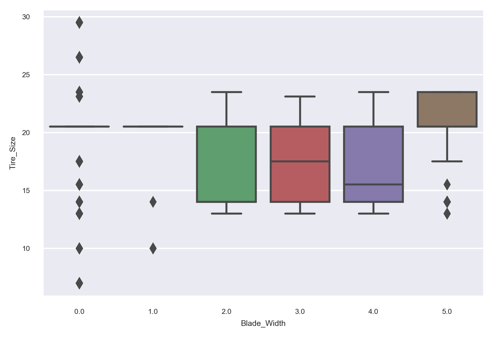

# Predicting the Sale Price of Bulldozers using ML

## Problem definition

Predict the auction sale price for a piece of heavy equipment to create a "blue book" for bulldozers.

## Data

> The data is downloaded from kaggle.com "Blue Book for Bulldozers competition.
The data for this competition is split into three parts:

Train.csv is the training set, which contains data through the end of 2011.  
Valid.csv is the validation set, which contains data from January 1, 2012 - April 30, 2012 You make predictions on this set throughout the majority of the competition. Your score on this set is used to create the public leaderboard.  
Test.csv is the test set, which won't be released until the last week of the competition. It contains data from May 1, 2012 - November 2012. Your score on the test set determines your final rank for the competition.

> https://www.kaggle.com/c/bluebook-for-bulldozers/overview

## Evaluation

The evaluation metric for this competition is the RMSLE (root mean squared log error) between the actual and predicted auction prices.

## Features

Features are shown here in a spreadsheet:  
https://docs.google.com/spreadsheets/d/1P0vZ7VYhBpJc-4-4mM4nvYoTzgnr-AF1F5eIMvcVd7Y/edit?usp=sharing # # #

> *It's a finished competition.*

* Best RMSLE score on validation data from Kaggle public leaderboard is :
*0.22909*
* My best RMSLE score on validation data for now is :
*0.24457*

Since there were a lot of categorical values, categorical features were encoded with Label Encoding rather than one hot.

## To-DO List
- [x] OneHotEncoding and LabelEncoding separately
- [x] Transform some categorical feature values into numerical values
- [x] Feature Selection and Extraction
- [ ] Try XGBoost also
- [x] More visualization to get an emphasis on data

One Hot Encoding won't be used due to large number of feature columns. 

> *In bulldozerv2, some changes were made.*  

 Some "Object" type features as "Tire Size", "Undercarriage Pad Width", "Stick Length" were transformed into numerical features.  
 Some ordinal features as "Usage Band", "Product Size", "Blade Width", "Enclosure Type", "Grouser Type" were mapped by meaningful values like "Low" = 1, "Medium" = 2, "High" = 3.
 
 
 Correlation of Numerical Features before changes were made:  
 
 
 
 
 Frequency of Sale Prices:  
 
 
 
   
 Distribution of Sale Prices due to Sale Year:  
 
 
 
   
 Product Size versus Sale Prices:  
  
 
 
 
 Product Size versus Tire Sizes (Train Set on the left and Valid Set on the right hand side):  
 
                              

 As it can be seen from graphs, Those features are positively correlated. High values are getting more frequent while product size is getting bigger.
 
 Blade Width versus Tire Sizes (Train Set on the left and Valid Set on the right hand side):  
 
                             
   
 As it can be seen from graphs, Those features are negatively correlated. Low values are getting more frequent while blade width is getting larger.
 
 ## Feature Selection
 
 > 2 procedures were followed while extracting features;  
 - Manually deleting unimportant features  
 - Backward Elimination method
 
 Baseline scores:
 
 - Model's performance on validation data before feature extraction 0.8761005065934953
 - Model's performance on train data before feature extraction 0.9294303560425823
 - rmsle:0.24592169141754905
 
 In Backward Elimination, features which p values' are higher than significance level (0.05) were deleted. 2 features were deleted through this procedure and the scores afterwards:  
 - Model's performance on validation data after backwards elimination 0.87622  
 - Model's performance on train data after backwards elimination 0.92786  
 - RMSLE:0.24485
 
 About the other procedure, manual procedure, After fitting Random Forest Regressor, from feature importances, relatively unimportant feautures were deleted;  
 Firstly, unimportant features have been deleted, starting with the "Thumb" feature. The scores were afterwards;  
 - Model's performance on validation data after feature extraction 0.87712  
 - Model's performance on train data after feature extraction 0.92913  
 - RMSLE:0.24555 
 
 Then, range of removing features were expanded and unimportant features have been deleted, starting with the "Ripper" feature. The scores were afterwards;  
 - Model's performance on validation data after feature extraction 0.87621  
 - Model's performance on train data after feature extraction 0.92228  
 - RMSLE:0.24457 (best RMSLE score)
 
 Then, yet again, range of removing features were expanded and unimportant features have been deleted, starting with the "Grouser_Tracks" feature. The scores were afterwards;  
 - Model's performance on validation data after feature extraction 0.87364  
 - Model's performance on train data after feature extraction 0.91566  
 - RMSLE:0.24460
 
 
 > Last edit: 29.06.2020
 
 
  
 
 
 
